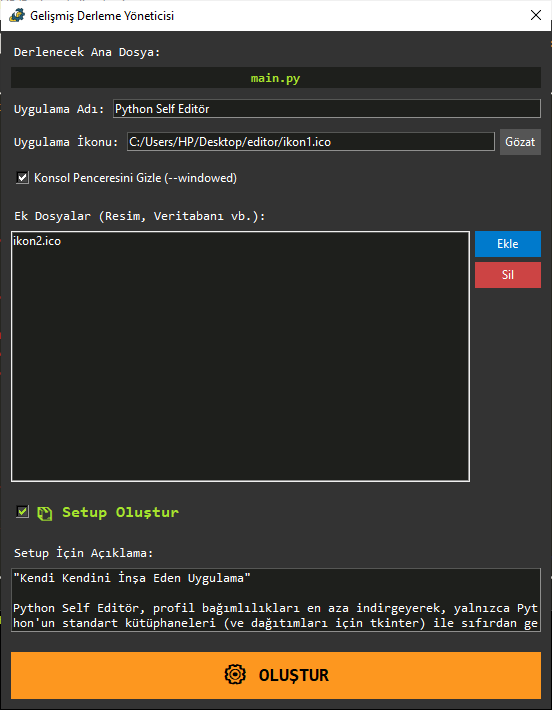
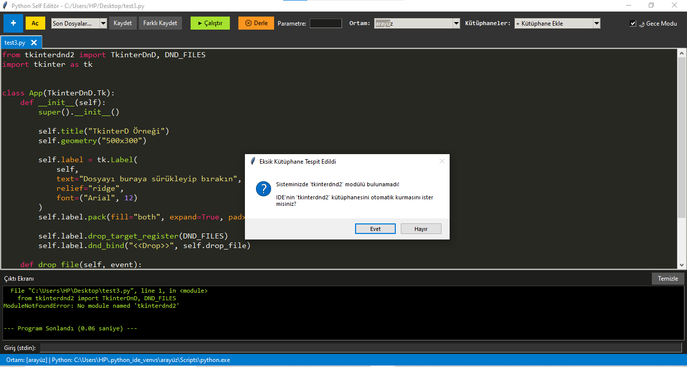

# Python Self Editör 🪶
**"Kendi Kendini İnşa Eden Uygulama"**

Python Self Editör, dışa bağımlılıkları en aza indirgeyerek, yalnızca Python'un standart kütüphaneleri (ve arayüz için `tkinter`) kullanılarak sıfırdan geliştirilmiş, son derece hafif, modüler ve akıllı bir Python Geliştirme Ortamıdır (IDE).

En büyük gurur kaynağı ise: **Bu IDE'nin geliştirilme sürecinin son aşamaları, bizzat IDE'nin kendi içinde kodlanmış ve derlenmiştir.**

## 📥 İndir ve Kur
Uygulamayı kodlarla uğraşmadan doğrudan kurmak için aşağıdaki bağlantıdan en güncel Setup sürümünü indirebilirsiniz:

👉 **[Python Self Editör Setup İndir](https://github.com/oguzesen/python-self-editor/releases/latest)**

## 💡 Diğer Editörlerden Farkı Ne?

Piyasadaki devasa, hantal ve RAM sömüren IDE'lerin aksine, Python Self Editör tamamen amaca odaklıdır. Eğitim, otomasyon ve hızlı prototipleme süreçleri için gereksiz menü kalabalığından arındırılmıştır. 

* **🛠 Dahili "Kendi Kurulumunu Üretme" Motoru:** Yazdığınız bir Python kodunu sadece tek parça `.exe` yapmakla kalmaz; hiçbir harici kütüphaneye (pywin32 vb.) ihtiyaç duymadan, VBScript mimarisiyle masaüstü kısayolu, uninstaller (kaldırıcı) ve kayıt defteri (registry) girdileri içeren **Profesyonel Setup Sihirbazları** üretir.
* **🧠 Akıllı Hata Yakalama ve Otomatik Kurulum:** Kodunuz çalışırken konsolda eksik kütüphane (`No module named...`) hatası yakalarsa, çalışmayı durdurup size "Bu kütüphaneyi sizin için kurayım mı?" diye sorar.
* **📦 Dahili Sanal Ortam (Venv) Yöneticisi:** Her proje için sistemden izole `.python_ide_venvs` klasöründe tek tıkla sanal ortamlar oluşturur, geçiş yapar ve ortamları yönetir. Terminale `pip install` yazmanıza gerek bırakmaz.
* **⚡ Sıfır Kilitlenme (Asenkron Çıktı):** `subprocess` ve `threading` kullanılarak geliştirilen altyapısı sayesinde kod çalışırken veya sonsuz döngüdeyken arayüz asla donmaz. Input/Output işlemleri gerçek zamanlı akar.

## ✨ Temel Özellikler

* **Sublime Text / Monokai** tarzı akıllı ve performanslı sözdizimi (syntax) renklendirmesi.
* Otomatik kod girintileme (auto-indent) ve sekme (tab) yönetimi.
* Tek pencerede Çoklu Sekme (Tab) desteği ve `Sürükle & Bırak` ile dosya açma.
* Kaydedilmemiş dosyaları (`●`) anında bildiren akıllı sekme yöneticisi.
* Canlı Gece/Gündüz tema geçişi.
* Çatal Bombası (Fork Bomb) korumalı derleme mimarisi.

## 📸 Ekran Görüntüleri

**Dahili, Bağımlılıksız Setup Sihirbazı Üreticisi:**

**Akıllı Hata Yakalama ve Kütüphane Kurulumu:**

---
*Kendi araçlarımızı üretmek, işin mutfağını öğrenmek için en iyi yöntemdir.*
